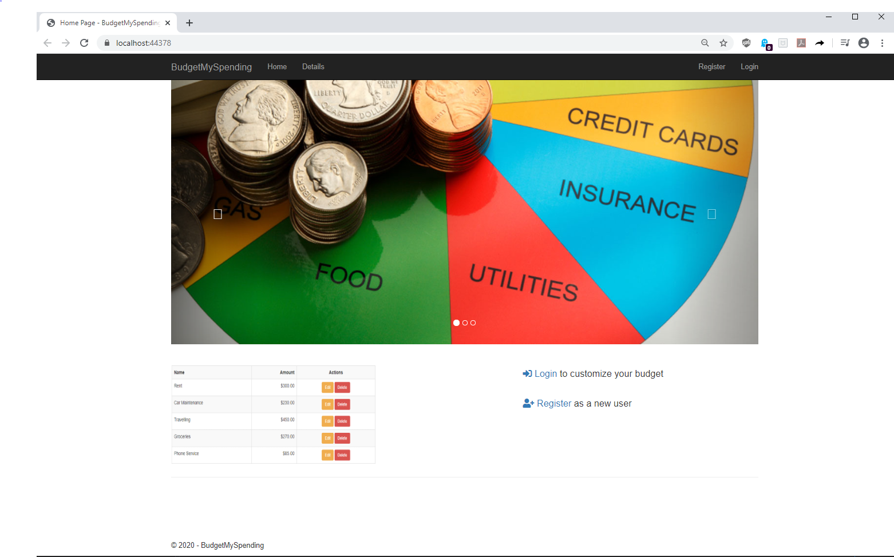
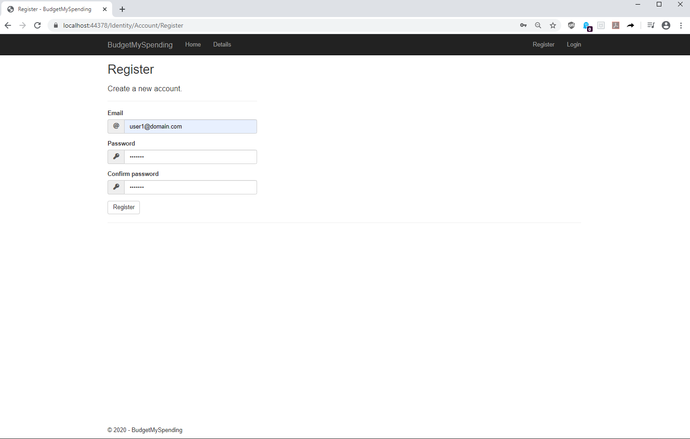
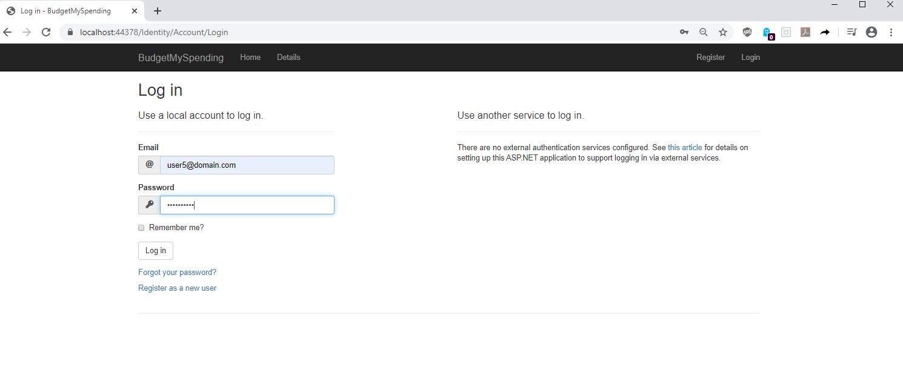
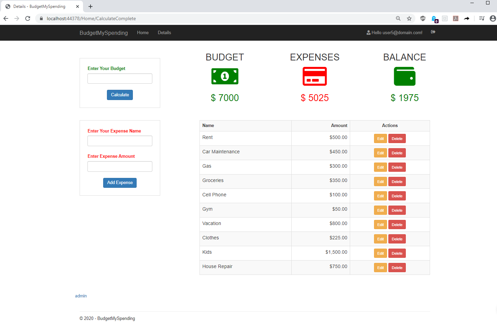
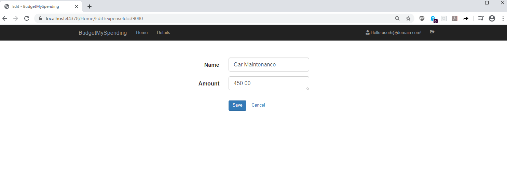
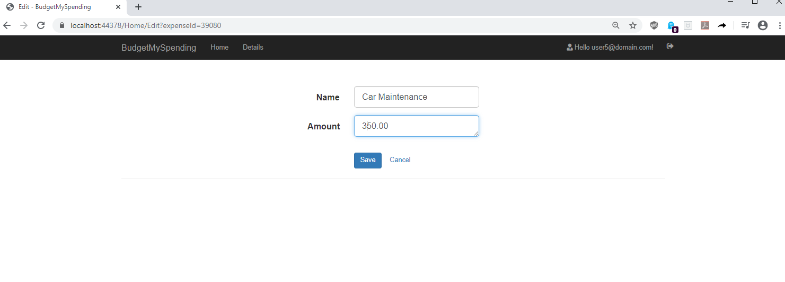
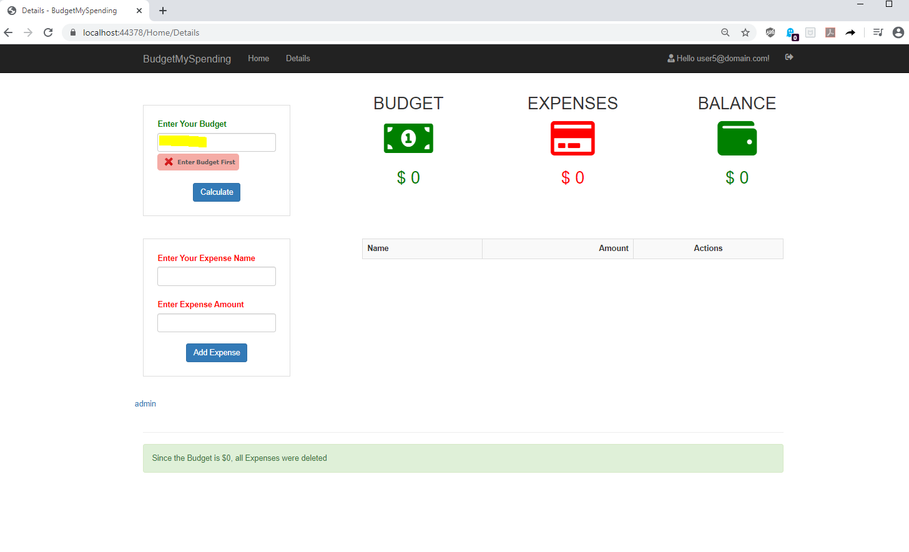

# AspNetCoreMvc_Budgeting_App

Budgeting application let users to keep their monthly budget in balance by managing their income and expenses.
There is an option to delete and edit expenses as well.

